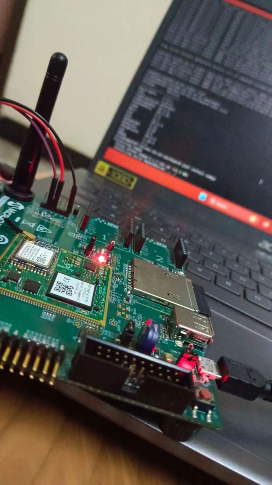
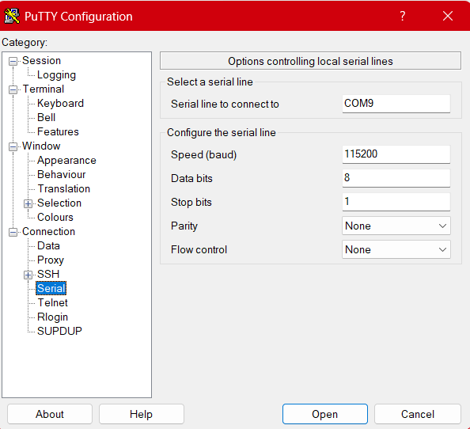

# AI-Face-Detection-using-ATSAMA5D27-WLSOM-EK1

## STEPS
1. Install OS Image
2. Flash the image to SD Card through Balena Etcher
3. Connect the board with laptop using usb to ttl connector
4. Open Putty for communication with board
5. Boot the board with OS

## INSTALLATION OF OS
There are two methods of OS installation:
1. Downloading OS image through website
2. Building OS from scratch

## NOTE: I Would recommend you to use Buildroot OS.

### 1. Downloading OS through website
[LINUX4SAM WEBSITE](https://www.linux4sam.org/bin/view/Linux4SAM/Sama5d27WLSom1EKMainPage)

- Visit the website and scroll down there you will see an option to download OS Image. We have two OS namely Buildroot OS and Yoctoproject OS. We have two varients in each OS which is headless and graphics. If you want to connect with Display and get video output, remember to download Graphics version for use.
- After downloading the OS extract it

 ### 2. Downloading OS from scratch
 [BuildRoot OS](https://www.linux4sam.org/bin/view/Linux4SAM/BuildRoot)

 - visit the website
 - There you have a set of unix commands to install buildroot os
 - Use Ubuntu and execute each commands to build your OS
 - You can even customise the OS by executing makemenuconfig and enable or disable certain functionalities

## FLASH IMAGE TO SD CARD
- After following the above steps you will be ready with SD image
- Now install [Balena etcher](https://etcher.balena.io/)
- Open Balena etcher and flash the image into your SD card

## CONNECT BOARD TO LAPTOP
- Now you have your sd card with OS. It's time to flash the board
- Insert SD card in board
- You need USB to TTL connector to connect board with laptop
- Connect it

## Putty FOR COMMUNICATION
- After making connections open putty for serial communication
- Enter the COM port and other infos
- Click open
- You will see a black screen
- Now press start button in board to boot

 

